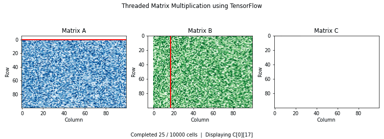

# OS_Task1
# 🧵 Multithreading Assignment

## 📌 Overview

Two programs that demonstrate multithreading, one in **Java** and one in **Python**:

1. **Producer-Consumer Problem using Java Threads** (packers, couriers and a shared shelf)
2. **Matrix Multiplication using Python Threads + TensorFlow with Animation**

Together they cover **thread creation, synchronization, shared resources, bounded buffers, graceful shutdown, thread pools, TensorFlow computation, and visualization**.

---

## 📂 Files in this Repository

| File | Description |
| --- | --- |
| `WarehouseSimulation.java` | Producer-Consumer program. Holds `WarehouseSimulation` (main), `Shelf` (shared buffer), `Packer` (producer) and `Courier` (consumer) |
| `matrix_animation.py` | Matrix multiplication using Threads + TensorFlow, followed by an animation of the recorded thread execution |
| `Matrix_multiplication.gif` | Animated output of a 100×100 run |
| `index.html` | Browser version of the animation, runs with no installation |
| `requirements.txt` | Python dependencies |
| `README.md` | Project documentation |

---

# 1️⃣ Producer-Consumer Problem

## 📖 Description

The **Producer-Consumer Problem** is implemented as a small warehouse. **Packers** (producers) make parcels and place them on a **Shelf** with a fixed capacity. **Couriers** (consumers) take parcels off the shelf and deliver them. Since every thread touches the same shelf, access has to be synchronized to avoid race conditions.

The number of packers, couriers, parcels per packer and the shelf capacity are all **entered by the user** at runtime, so the program can be tested with one producer and one consumer or with many of each.

### ⚙️ Working

`Shelf` wraps a `LinkedList` queue, a `capacity`, and an `open` flag.

`put()` and `take()` are declared `synchronized`, so only one thread can touch the queue at a time.

If the shelf is full, a Packer waits:

```java
while (queue.size() == capacity) {
    wait();
}
```

If the shelf is empty **and still open**, a Courier waits:

```java
while (queue.isEmpty() && open) {
    wait();
}
```

After adding or removing a parcel, the thread calls:

```java
notifyAll();
```

so any waiting thread re-checks its condition. The conditions sit inside `while` loops rather than `if`, so a thread that wakes up re-tests before continuing.

Shutdown is handled explicitly. Once `main` has joined every Packer, it calls:

```java
shelf.close();
```

which sets `open = false` and wakes all Couriers. `take()` then returns `null` when the shelf is empty, and each Courier exits its loop. Without this, idle couriers would sit in `wait()` forever.

---

## 🔹 Concepts Used

- Java Threads and `Runnable`
- Multiple Producers and Consumers
- Shared Resource (bounded buffer)
- `synchronized`
- `wait()` / `notifyAll()`
- Condition checks in `while` loops
- Graceful consumer shutdown
- `Thread.join()`

---

## 🔹 Entry Point

```java
public static void main(String[] args) throws InterruptedException {
    Scanner sc = new Scanner(System.in);

    int capacity = sc.nextInt();          // shelf capacity
    int packers = sc.nextInt();           // number of producers
    int couriers = sc.nextInt();          // number of consumers
    int parcelsPerPacker = sc.nextInt();  // parcels each producer makes

    Shelf shelf = new Shelf(capacity);

    // start packers and couriers ...
    // join packers, then shelf.close(), then join couriers
}
```

---

## ▶️ How to Run

### Using Terminal

Compile:

```bash
javac WarehouseSimulation.java
```

Run:

```bash
java WarehouseSimulation
```

### Using an IDE

1. Create a Java project.
2. Add `WarehouseSimulation.java` to the default package.
3. Run it as a **Java Application** and enter the four values when prompted.

---

## 🖥️ Sample Output

Input: capacity **3**, **2** packers, **2** couriers, **3** parcels per packer.

```text
 Enter Shelf capacity: 3
Enter Number of packers: 2
Enter Number of couriers: 2
Enter Parcels per packer: 3
Produced: Parcel 1 from Packer 2
Produced: Parcel 1 from Packer 1
Delivered: Parcel 1 from Packer 2 by Courier 1
Delivered: Parcel 1 from Packer 1 by Courier 2
Produced: Parcel 2 from Packer 1
Delivered: Parcel 2 from Packer 1 by Courier 2
Produced: Parcel 2 from Packer 2
Delivered: Parcel 2 from Packer 2 by Courier 1
Produced: Parcel 3 from Packer 1
Produced: Parcel 3 from Packer 2
Delivered: Parcel 3 from Packer 1 by Courier 1
Delivered: Parcel 3 from Packer 2 by Courier 2
Simulation completed.
```

> The exact order varies between runs because the Packers and Couriers run concurrently. What never changes: the shelf never holds more than `capacity` parcels, every parcel is delivered exactly once, and the program ends with no courier left waiting.

---

# 2️⃣ Matrix Multiplication using Threads + TensorFlow

## 📖 Description

The second program multiplies two random matrices using Python threads and TensorFlow. Matrix sizes are entered by the user with a **minimum of 100×100**.

```text
Matrix A (rows×cols) × Matrix B (cols×cols)
                    ↓
             Matrix C (rows×cols)
```

For a 100×100 run the result has **10,000 cells**, and the program creates **10,000 individual cell-computation tasks**. Each task computes one cell of C as the dot product of one row of A and one column of B.

---

## ⚙️ How It Works

The program first generates A and B with TensorFlow as random integers from 1 to 9:

```python
A = tf.random.uniform((rows, cols), 1, 10, dtype=tf.int32)
B = tf.random.uniform((cols, cols), 1, 10, dtype=tf.int32)
```

`CellComputer` unstacks A into a list of rows and B into a list of columns once, so each task only has to index a list:

```python
self.rows = tf.unstack(A, axis=0)
self.cols = tf.unstack(B, axis=1)
```

The dot product is a compiled TensorFlow function:

```python
@staticmethod
@tf.function
def dot(row, col):
    return tf.tensordot(row, col, axes=1)
```

It is called once before the threads start so `tf.function` is already traced; otherwise the first batch of tasks would all try to compile it at the same time.

`ThreadPoolExecutor` then creates a pool of `os.cpu_count()` worker threads, and every `(row, column)` position of C is submitted as an independent task. Each task stores its result in `C[i][j]` and the program checks the final matrix against `tf.matmul(A, B)`.

---

## 🧵 Recording Thread Execution

`ExecutionRecorder` records the order in which cells are actually completed:

```python
def record(self, i, j):
    with self.lock:
        self.order.append((i, j))
```

A `threading.Lock()` makes the recording thread-safe, since every worker appends to the same deque. Writing to `C[i][j]` needs no lock because each task writes a different cell.

The animation replays this recorded list, so it shows the **real completion order of the threaded computation**, not a predefined row-by-row sequence.

---

## 🎬 Matrix Multiplication Animation

The animation has three panels:

- 🔵 **Matrix A** – a red horizontal marker shows the row being read.
- 🟢 **Matrix B** – a red vertical marker shows the column being read.
- 🟠 **Matrix C** – result cells appear as the recorded tasks complete, 25 per frame.

### 🎥 Animation Output



Because the fill order comes from the recorder, C does not fill in a clean sweep. The scattered pattern is the thread pool finishing tasks out of order.


## 🌐 Browser Demo

`index.html` draws the same three panels using HTML5 Canvas. Open it in any browser, enter rows and columns (minimum 100) and press **Start**. It runs on the single JavaScript thread and fills cells in row-major order, so it shows the one-task-per-cell idea without needing TensorFlow installed.

---

## 🔹 Concepts Used

- Python Multithreading
- `ThreadPoolExecutor` and `as_completed`
- TensorFlow (`tf.random.uniform`, `tf.unstack`, `tf.tensordot`)
- `@tf.function` compilation
- Thread-Safe Recording with `threading.Lock()`
- Result verification against `tf.matmul`
- NumPy
- Matplotlib `FuncAnimation`
- GIF export with Pillow

---

## ▶️ Installation

```bash
pip install -r requirements.txt
```

or

```bash
pip install tensorflow numpy matplotlib pillow
```

---

## ▶️ Run

```bash
python matrix_animation.py
```

On Windows with the `py` launcher:

```powershell
py -3.12 matrix_animation.py
```

The program asks for rows and columns, runs the threaded multiplication, prints the time taken and a sample of the result, verifies it against `tf.matmul`, and then either shows the animation or saves it as `Matrix_multiplication.gif`.

---

## 🖥️ Sample Output

Input: **100** rows, **100** columns, save as GIF.

```text
Rows: 100
Columns: 100
Generating matrices with TensorFlow...
Total tasks: 10000
Worker threads: 8
done 1000 / 10000
done 2000 / 10000
done 3000 / 10000
done 4000 / 10000
done 5000 / 10000
done 6000 / 10000
done 7000 / 10000
done 8000 / 10000
done 9000 / 10000
done 10000 / 10000

Finished in 7.850 seconds
Matches tf.matmul: True
Top-left 3x3 of C:
[[2169. 2524. 2447.]
 [2173. 2526. 2458.]
 [2191. 2555. 2551.]]

Save as Matrix_multiplication.gif instead of showing? (y/n): y
saving Matrix_multiplication.gif ...
saved
```

> Matrix values change between runs because A and B are random. Execution time depends on the system and on the number of worker threads. `Matches tf.matmul: True` confirms the threaded result equals TensorFlow's built-in multiplication.

---

# 🛠️ Technologies Used

| Technology | Purpose |
| --- | --- |
| ☕ Java | Producer-Consumer implementation |
| 🧵 Java Threads | Packer and Courier execution |
| 🔐 Synchronization | Safe shared-shelf access with `synchronized`, `wait()`, `notifyAll()` |
| 🐍 Python | Matrix multiplication |
| 🧵 ThreadPoolExecutor | Worker-thread management |
| 🔒 threading.Lock | Thread-safe execution recording |
| 🤖 TensorFlow | Matrix generation and per-cell dot products |
| 🔢 NumPy | Result matrix storage and verification |
| 📊 Matplotlib | Animation and visualization |
| 🖼️ Pillow | GIF export |
| 🌐 HTML5 Canvas | Browser version of the animation |

---

# 📋 Requirements

### ☕ Java

- JDK 8 or above

### 🐍 Python

- Python 3.10 or above
- TensorFlow 2.10 or above
- NumPy
- Matplotlib
- Pillow

Install the Python dependencies with:

```bash
pip install -r requirements.txt
```

---

# 🎯 Learning Outcomes

- Creating, starting and joining threads
- Synchronizing access to a shared bounded buffer
- Why `wait()` belongs inside a `while` loop and why `notifyAll()` is used
- Shutting consumers down cleanly instead of leaving them blocked
- Splitting a large computation into thousands of independent tasks
- Managing those tasks with a thread pool
- Knowing when shared state needs a lock and when it does not
- Verifying a parallel result against a sequential reference
- Turning recorded thread execution into a visualization

---

# 📌 Conclusion

The **Producer-Consumer program** shows how several threads can share one bounded buffer safely, block when it is full or empty, and shut down cleanly once production stops. The **Matrix Multiplication program** shows how a large computation can be broken into thousands of small tasks and processed by a thread pool, with the result verified against TensorFlow's own implementation.

The animation ties the two ideas together by replaying the real order in which the worker threads finished their cells, making the concurrent execution visible.# OS_Task1
# 🧵 Multithreading Assignment

## 📌 Overview

Two programs that demonstrate multithreading, one in **Java** and one in **Python**:

1. **Producer-Consumer Problem using Java Threads** (packers, couriers and a shared shelf)
2. **Matrix Multiplication using Python Threads + TensorFlow with Animation**

Together they cover **thread creation, synchronization, shared resources, bounded buffers, graceful shutdown, thread pools, TensorFlow computation, and visualization**.

---

## 📂 Files in this Repository

| File | Description |
| --- | --- |
| `WarehouseSimulation.java` | Producer-Consumer program. Holds `WarehouseSimulation` (main), `Shelf` (shared buffer), `Packer` (producer) and `Courier` (consumer) |
| `matrix_animation.py` | Matrix multiplication using Threads + TensorFlow, followed by an animation of the recorded thread execution |
| `Matrix_multiplication.gif` | Animated output of a 100×100 run |
| `index.html` | Browser version of the animation, runs with no installation |
| `requirements.txt` | Python dependencies |
| `README.md` | Project documentation |

---

# 1️⃣ Producer-Consumer Problem

## 📖 Description

The **Producer-Consumer Problem** is implemented as a small warehouse. **Packers** (producers) make parcels and place them on a **Shelf** with a fixed capacity. **Couriers** (consumers) take parcels off the shelf and deliver them. Since every thread touches the same shelf, access has to be synchronized to avoid race conditions.

The number of packers, couriers, parcels per packer and the shelf capacity are all **entered by the user** at runtime, so the program can be tested with one producer and one consumer or with many of each.

### ⚙️ Working

`Shelf` wraps a `LinkedList` queue, a `capacity`, and an `open` flag.

`put()` and `take()` are declared `synchronized`, so only one thread can touch the queue at a time.

If the shelf is full, a Packer waits:

```java
while (queue.size() == capacity) {
    wait();
}
```

If the shelf is empty **and still open**, a Courier waits:

```java
while (queue.isEmpty() && open) {
    wait();
}
```

After adding or removing a parcel, the thread calls:

```java
notifyAll();
```

so any waiting thread re-checks its condition. The conditions sit inside `while` loops rather than `if`, so a thread that wakes up re-tests before continuing.

Shutdown is handled explicitly. Once `main` has joined every Packer, it calls:

```java
shelf.close();
```

which sets `open = false` and wakes all Couriers. `take()` then returns `null` when the shelf is empty, and each Courier exits its loop. Without this, idle couriers would sit in `wait()` forever.

---

## 🔹 Concepts Used

- Java Threads and `Runnable`
- Multiple Producers and Consumers
- Shared Resource (bounded buffer)
- `synchronized`
- `wait()` / `notifyAll()`
- Condition checks in `while` loops
- Graceful consumer shutdown
- `Thread.join()`

---

## 🔹 Entry Point

```java
public static void main(String[] args) throws InterruptedException {
    Scanner sc = new Scanner(System.in);

    int capacity = sc.nextInt();          // shelf capacity
    int packers = sc.nextInt();           // number of producers
    int couriers = sc.nextInt();          // number of consumers
    int parcelsPerPacker = sc.nextInt();  // parcels each producer makes

    Shelf shelf = new Shelf(capacity);

    // start packers and couriers ...
    // join packers, then shelf.close(), then join couriers
}
```

---

## ▶️ How to Run

### Using Terminal

Compile:

```bash
javac WarehouseSimulation.java
```

Run:

```bash
java WarehouseSimulation
```

### Using an IDE

1. Create a Java project.
2. Add `WarehouseSimulation.java` to the default package.
3. Run it as a **Java Application** and enter the four values when prompted.

---

## 🖥️ Sample Output

Input: capacity **3**, **2** packers, **2** couriers, **3** parcels per packer.

```text
 Enter Shelf capacity: 3
Enter Number of packers: 2
Enter Number of couriers: 2
Enter Parcels per packer: 3
Produced: Parcel 1 from Packer 2
Produced: Parcel 1 from Packer 1
Delivered: Parcel 1 from Packer 2 by Courier 1
Delivered: Parcel 1 from Packer 1 by Courier 2
Produced: Parcel 2 from Packer 1
Delivered: Parcel 2 from Packer 1 by Courier 2
Produced: Parcel 2 from Packer 2
Delivered: Parcel 2 from Packer 2 by Courier 1
Produced: Parcel 3 from Packer 1
Produced: Parcel 3 from Packer 2
Delivered: Parcel 3 from Packer 1 by Courier 1
Delivered: Parcel 3 from Packer 2 by Courier 2
Simulation completed.
```

> The exact order varies between runs because the Packers and Couriers run concurrently. What never changes: the shelf never holds more than `capacity` parcels, every parcel is delivered exactly once, and the program ends with no courier left waiting.

---

# 2️⃣ Matrix Multiplication using Threads + TensorFlow

## 📖 Description

The second program multiplies two random matrices using Python threads and TensorFlow. Matrix sizes are entered by the user with a **minimum of 100×100**.

```text
Matrix A (rows×cols) × Matrix B (cols×cols)
                    ↓
             Matrix C (rows×cols)
```

For a 100×100 run the result has **10,000 cells**, and the program creates **10,000 individual cell-computation tasks**. Each task computes one cell of C as the dot product of one row of A and one column of B.

---

## ⚙️ How It Works

The program first generates A and B with TensorFlow as random integers from 1 to 9:

```python
A = tf.random.uniform((rows, cols), 1, 10, dtype=tf.int32)
B = tf.random.uniform((cols, cols), 1, 10, dtype=tf.int32)
```

`CellComputer` unstacks A into a list of rows and B into a list of columns once, so each task only has to index a list:

```python
self.rows = tf.unstack(A, axis=0)
self.cols = tf.unstack(B, axis=1)
```

The dot product is a compiled TensorFlow function:

```python
@staticmethod
@tf.function
def dot(row, col):
    return tf.tensordot(row, col, axes=1)
```

It is called once before the threads start so `tf.function` is already traced; otherwise the first batch of tasks would all try to compile it at the same time.

`ThreadPoolExecutor` then creates a pool of `os.cpu_count()` worker threads, and every `(row, column)` position of C is submitted as an independent task. Each task stores its result in `C[i][j]` and the program checks the final matrix against `tf.matmul(A, B)`.

---

## 🧵 Recording Thread Execution

`ExecutionRecorder` records the order in which cells are actually completed:

```python
def record(self, i, j):
    with self.lock:
        self.order.append((i, j))
```

A `threading.Lock()` makes the recording thread-safe, since every worker appends to the same deque. Writing to `C[i][j]` needs no lock because each task writes a different cell.

The animation replays this recorded list, so it shows the **real completion order of the threaded computation**, not a predefined row-by-row sequence.

---

## 🎬 Matrix Multiplication Animation

The animation has three panels:

- 🔵 **Matrix A** – a red horizontal marker shows the row being read.
- 🟢 **Matrix B** – a red vertical marker shows the column being read.
- 🟠 **Matrix C** – result cells appear as the recorded tasks complete, 25 per frame.

### 🎥 Animation Output


Because the fill order comes from the recorder, C does not fill in a clean sweep. The scattered pattern is the thread pool finishing tasks out of order.

---

## 🌐 Browser Demo

`index.html` draws the same three panels using HTML5 Canvas. Open it in any browser, enter rows and columns (minimum 100) and press **Start**. It runs on the single JavaScript thread and fills cells in row-major order, so it shows the one-task-per-cell idea without needing TensorFlow installed.

---

## 🔹 Concepts Used

- Python Multithreading
- `ThreadPoolExecutor` and `as_completed`
- TensorFlow (`tf.random.uniform`, `tf.unstack`, `tf.tensordot`)
- `@tf.function` compilation
- Thread-Safe Recording with `threading.Lock()`
- Result verification against `tf.matmul`
- NumPy
- Matplotlib `FuncAnimation`
- GIF export with Pillow

---

## ▶️ Installation

```bash
pip install -r requirements.txt
```

or

```bash
pip install tensorflow numpy matplotlib pillow
```

---

## ▶️ Run

```bash
python matrix_animation.py
```

On Windows with the `py` launcher:

```powershell
py -3.12 matrix_animation.py
```

The program asks for rows and columns, runs the threaded multiplication, prints the time taken and a sample of the result, verifies it against `tf.matmul`, and then either shows the animation or saves it as `Matrix_multiplication.gif`.

---

## 🖥️ Sample Output

Input: **100** rows, **100** columns, save as GIF.

```text
Rows: 100
Columns: 100
Generating matrices with TensorFlow...
Total tasks: 10000
Worker threads: 8
done 1000 / 10000
done 2000 / 10000
done 3000 / 10000
done 4000 / 10000
done 5000 / 10000
done 6000 / 10000
done 7000 / 10000
done 8000 / 10000
done 9000 / 10000
done 10000 / 10000

Finished in 7.850 seconds
Matches tf.matmul: True
Top-left 3x3 of C:
[[2169. 2524. 2447.]
 [2173. 2526. 2458.]
 [2191. 2555. 2551.]]

Save as Matrix_multiplication.gif instead of showing? (y/n): y
saving Matrix_multiplication.gif ...
saved
```

> Matrix values change between runs because A and B are random. Execution time depends on the system and on the number of worker threads. `Matches tf.matmul: True` confirms the threaded result equals TensorFlow's built-in multiplication.

---

# 🛠️ Technologies Used

| Technology | Purpose |
| --- | --- |
| ☕ Java | Producer-Consumer implementation |
| 🧵 Java Threads | Packer and Courier execution |
| 🔐 Synchronization | Safe shared-shelf access with `synchronized`, `wait()`, `notifyAll()` |
| 🐍 Python | Matrix multiplication |
| 🧵 ThreadPoolExecutor | Worker-thread management |
| 🔒 threading.Lock | Thread-safe execution recording |
| 🤖 TensorFlow | Matrix generation and per-cell dot products |
| 🔢 NumPy | Result matrix storage and verification |
| 📊 Matplotlib | Animation and visualization |
| 🖼️ Pillow | GIF export |
| 🌐 HTML5 Canvas | Browser version of the animation |

---

# 📋 Requirements

### ☕ Java

- JDK 8 or above

### 🐍 Python

- Python 3.10 or above
- TensorFlow 2.10 or above
- NumPy
- Matplotlib
- Pillow

Install the Python dependencies with:

```bash
pip install -r requirements.txt
```

---

# 🎯 Learning Outcomes

- Creating, starting and joining threads
- Synchronizing access to a shared bounded buffer
- Why `wait()` belongs inside a `while` loop and why `notifyAll()` is used
- Shutting consumers down cleanly instead of leaving them blocked
- Splitting a large computation into thousands of independent tasks
- Managing those tasks with a thread pool
- Knowing when shared state needs a lock and when it does not
- Verifying a parallel result against a sequential reference
- Turning recorded thread execution into a visualization

---

# 📌 Conclusion

The **Producer-Consumer program** shows how several threads can share one bounded buffer safely, block when it is full or empty, and shut down cleanly once production stops. The **Matrix Multiplication program** shows how a large computation can be broken into thousands of small tasks and processed by a thread pool, with the result verified against TensorFlow's own implementation.

The animation ties the two ideas together by replaying the real order in which the worker threads finished their cells, making the concurrent execution visible.
